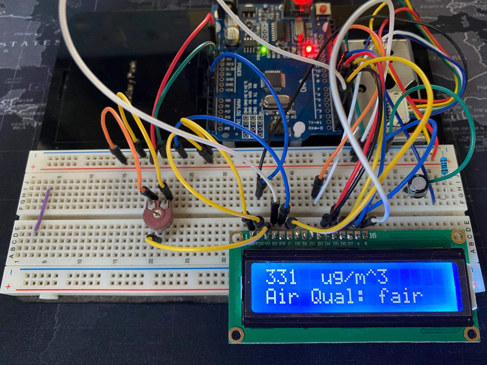
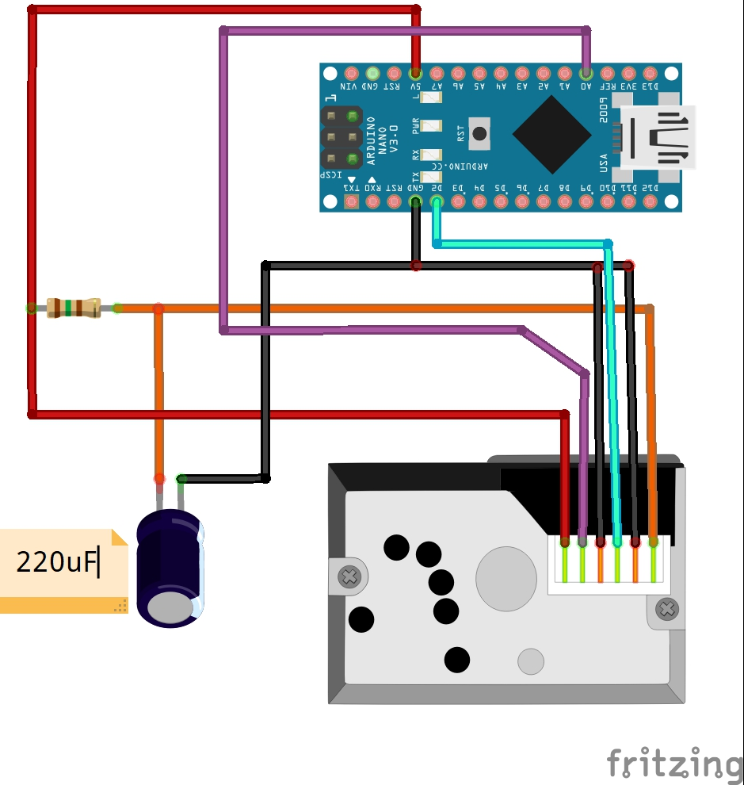

# arduino air quality sensor
My wife is a coffee roaster.  During the roasting process, byproducts are encouraged by forced air to leave via the duct work and get exhausted to the outside while the tasty roasted beans stay in the roaster.

Consider:
1. No ventilation is perfect
2. Particulate matter is bad for you - Research shows that exposure to small partuculate matter has a negative impact on longevity, see e.g. how longevity in Pittsburgh increased after the steel plants closed down.
3. I love my wife

I wired up this dust sensor as an attempt to measure the change in air quality in the roasting house during one of her roasting sessions. The dust sensor is the shiny metal rectangle in the upper right hand corner of the image.  
  

## TL;DR:
Grab `running_average_dust_sensor.ino` script and flash it to an Arduino Uno (or clone).  Wire it up and you are done.

## My process
I built it up in steps: 
- make the dust sensor work via the console
- make the lcd print anything
- make the dust sensor print to the lcd
- add running average to script to smooth out measurement
- add conversion from dust density to 'air quality'

Image for wiring up the dust sensor:  
  
Borrowed from [here](https://create.arduino.cc/projecthub/mircemk/diy-air-quality-monitor-with-sharp-gp2y1010au0f-sensor-7b0262)

Image for wiring up the LCD:
  
Borrowed from [here](https://www.arduino.cc/en/Tutorial/HelloWorld)
